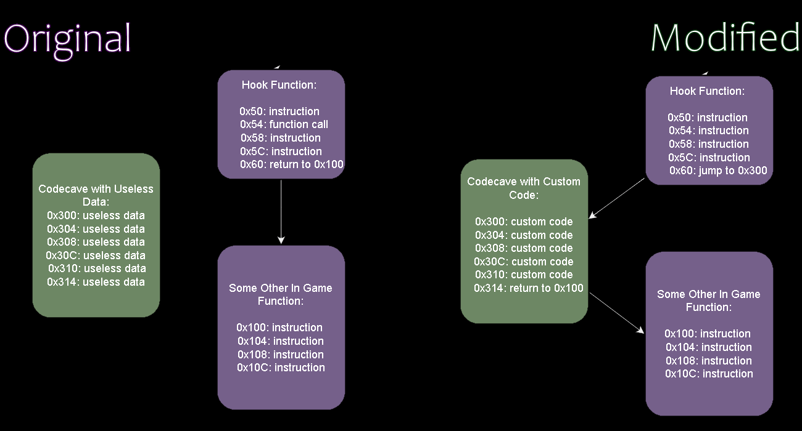

# C/C++ Game Modding Utility

**This utility aims to make writing mods for 5th/6th generation console games in C/C++ easier.**   
  
It streamlines the process of
- Compiling, linking & extracting mod code
- Interacting with in game memory addresses in mod code
- Injecting compiled code into game files
- Rebuilding game ISO
- Injecting into [supported emulators](https://github.com/C0mposer/C-Game-Modding-Utility?tab=readme-ov-file#supported-emulators) for quick testing of mod

#### This utility currently supports:
- Playstation 1 Games
- Playstation 2 Games
- Gamecube Games
- Wii Games

[Click here to see the Wiki](https://github.com/C0mposer/C-Game-Modding-Utility/wiki)

## Quick Start:
***This quick start guide will get you up and running with a mod in C that runs every frame along side your game of choice***

### Creating a Project
1. Click "Create New Project", and give it a name
2. Choose your games platform
3. Click "Extract ISO File", and choose your games .iso/.bin/.ciso/etc

Here is an example project:  


After doing the basic project setup, you'll need to find a ***code cave(s)*** to place your mod code, and a ***hook*** to jump to it.

### Code Caves and Hooks
At a high level, here is how injecting compiled mod code into a game using this utility works:

#### Code Caves
We need a free place in the games memory that can be used to store our mod code. The easiest way is to look for unused/free sections of the games main executable, that can be repurposed.
These free sections are called [code caves.](https://en.wikipedia.org/wiki/Code_cave)  (*These can unused/debug strings, unused functions/code, sometimes a block of 0's, etc*.  
You can use the built in [Codecave Finder](google.com) to find one.

Here is an example codecave in a Wii game:

  
*If you need more help finding a code cave, [see here](https://github.com/C0mposer/C-Game-Modding-Utility/wiki/Code-Caves)*
#### Hooks
A [hook](https://en.wikipedia.org/wiki/Hooking#:~:text=Function%20hooking%20is%20implemented%20by,injected%20code) is a function in the original game that we will redirect to our custom code. The most simple and useful type of hook is a function in the original game that gets ran every frame. Our custom code runs whenever the hooked function runs. So if our hook runs every frame, so will our custom code!  
You can click [Auto-Detect Hook](google.com) to look for common every frame hook(s). If you want to manually find one, [see here](https://github.com/C0mposer/C-Game-Modding-Utility/wiki/Hooks)

Here is a very basic visualization of the concept:


By default, the automaticly detected hook uses ***asm/AutoHook_DEFAULT_BUILD.s*** as the asm file that jumps/branches to the codecave. By default, main_hook.s jumps/branches to the **ModMain()** function, in the main.c file
```py
# AutoHook_DEFAULT_BUILD.s
j ModMain
```

If you want to change which function gets jumped to by the hook, you can change the **.s** file to jump/branch to any function in your project. (*Keep this in mind if you rename ModMain()*)

### Writing Mods
Once you have found a codecave to place your mod code, and a hook to jump to it, you are ready to start writing mods for your game! 
It will have created a folder for your mod in the **projects/** folder of the utility that you can start editing code in. 
*(You can automatically integrate your project with VSCode, Zed, Sublime, or Notepad++ with the [Text Editor](google.com) tab in the utility.)*

So how do we talk with in game memory addresses in our code directly?
#### Symbols
- **Symbols:** Symbols are in game variables that you want to use & in game functions you want to call. You can use memory seraching tools similar to Cheat Engine, in combination with debugging emulators and decompilation tools like Ghidra in order to find in game symbols.

Once you have found symbols you want to use in your mod code, you must do 2 things:

A. You must declare the name of the symbol, with it's memory address in the symbols file for the current build version. The default will be **symbols/DEFAULT.txt 

```c
// Example Variables:
//In Game Variables
coins = 0x8080DD84;
lives = 0x8080DD86;
jump_height = 0x8080DD00;
current_items = 0x8080DA00;
player_position = 0x8080DC00;

// Example Functions:
ReturnCompletionPercentage = 0x800501C0;
DrawText = 0x80048250;

B. You must declare the symbols type, or function prototype in a header using the extern keyword

```c
// symbols.h
#include <Vec.h>

//In Game Variables:
extern short coins; 
extern short lives; 
extern int jump_height;
extern int current_items[20];
extern Vec3 player_position;  

//In Game Functions
extern int ReturnCompletionPercentage(void);
extern void DrawText(char* text_string, int x, int y);

```

Once you declare the symbols address in the symbols file, and type/prototype the header file, you can use them in your code like any other variable/function:
```c
#include <symbols.h>

//Mod Code
void CustomFunction(void) 
{
    int percentage = ReturnCompletionPercentage();
    if (percentage >= 50)
    {
        lives = 99;
        jump_height = 20;
        DrawText("Mod Activated!", 10, 30);
    }
    return;
}
```

### Compiling, Building, & Injecting
Once you have written some code, go to the **Build** tab, and you can compile it with the "**Compile**" button in the utility, or with the [**Command Line Interface**](google.com)

If the compilation is successful, you can then build your mod into an ISO by clicking "Build ISO"

You can also inject your mod into [supported emulators](google.com) to easily test your mod without rebuilding an entire iso. 

## Recommended Tools
 - [Ghidra](https://github.com/NationalSecurityAgency/ghidra/releases) is a swiss army knife for reverse engineering. In combination with the plugins below, it can make decompiling games a much nicer experience:
 ~ [PS1 Ghidra Plugin](https://github.com/lab313ru/ghidra_psx_ldr)
 ~ [PS2 Ghidra Plugin](https://github.com/chaoticgd/ghidra-emotionengine-reloaded)
 ~ [Gamecube/Wii Ghidra Plugin](https://github.com/Cuyler36/Ghidra-GameCube-Loader)
 ~ [N64 Ghidra Plugin](https://github.com/zeroKilo/N64LoaderWV)
 - [Bizhawk](https://tasvideos.org/BizHawk/ReleaseHistory#Bizhawk261) for memory searching in PS1 games
 - [Cheat Engine](https://github.com/cheat-engine/cheat-engine) for memory searching in PS2 games, and other programs
 - [Dolphin Memory Engine](https://github.com/aldelaro5/Dolphin-memory-engine) for memory searching in Gamecube/Wii games
 - [P64 Dev](https://www.pj64-emu.com/nightly-builds) for memory searching in Nintendo 64 games
- [VSCode](https://github.com/microsoft/vscode) or [Sublime](https://www.sublimetext.com/) text editors, for automatic integration with projects
## Supported Emulators
#### Gamecube Emulators
 - [Dolphin](https://dolphin-emu.org/download)  
 #### PS2 Emulators
 - [PCSX2](https://pcsx2.net/)  
 #### PS1 Emulators
 - [Duckstation](https://github.com/stenzek/duckstation/releases/tag/latest)  
 - [Mednefan 1.31](https://mednafen.github.io/releases/)  
 - [Mednefan 1.29](https://mednafen.github.io/releases/)  
 - [Bizhawk 2.6.1](https://tasvideos.org/BizHawk/ReleaseHistory#Bizhawk261)  

## Bundled Tools / Special Thanks
 - [devkitPro](https://github.com/devkitPro) for GCC toolchains targeted towards Gamecube/Wii PPC, as well as utilities for analyzing .dol files
 - [ps2toolchain](https://github.com/ps2dev/ps2toolchain) for GCC toolchains targeted towards the PS2 Emotion Engine CPU.
 - [mkpsxiso](https://github.com/Lameguy64/mkpsxiso) for extracting & rebuilding PS1 disk images.
  - [Ps2IsoTools](https://github.com/Finzenku/Ps2IsoTools) for rebuilding PS2 disk images.
 - [gc_fst](https://github.com/AlexanderHarrison/gc_fst) for extracting & rebuilding Gamecube images.
 - [wiimms-iso-tools](https://github.com/Wiimm/wiimms-iso-tools) for extracting & rebuilding Wii disk images.
 - [DolphinTool](https://github.com/dolphin-emu/dolphin) for converting between the different GC/Wii image formats.
 - [dolphin-memory-engine](https://github.com/aldelaro5/dolphin-memory-engine) for interacting with Dolphin's emulator memory.
  - [xdelta](https://github.com/jmacd/xdelta) for the creation of xdelta patch files
  - [7zip](https://github.com/mcmilk/7-Zip) for solving life's greatest mysteries
  - [Real N64 CRC Tool](https://www.smwcentral.net/?p=section&a=details&id=8799) for updating N64 rom CRC's

## Contact

If you need any help using this utility, feel free to reach out to me on discord: **Composer** :)
