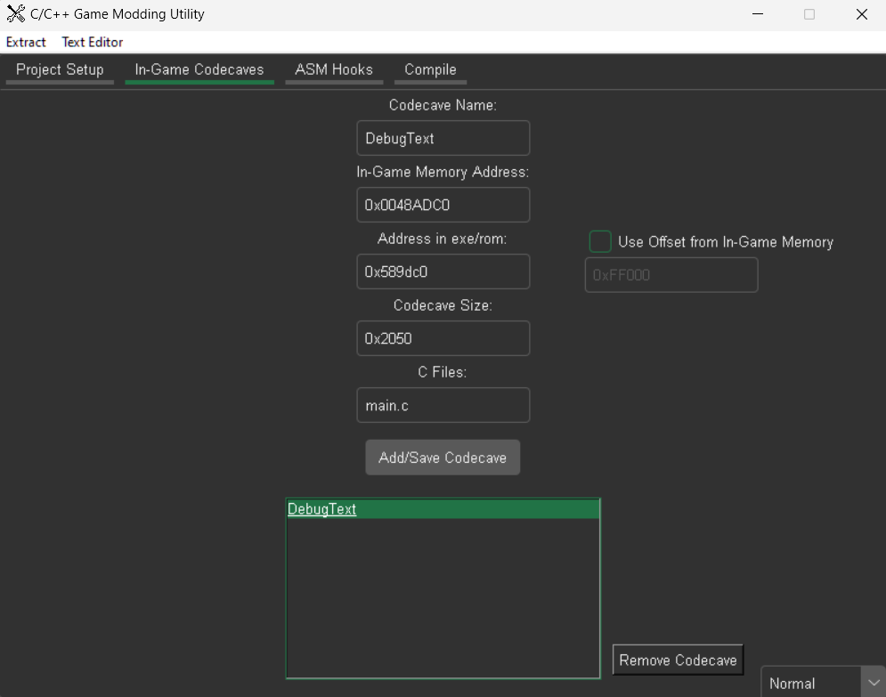
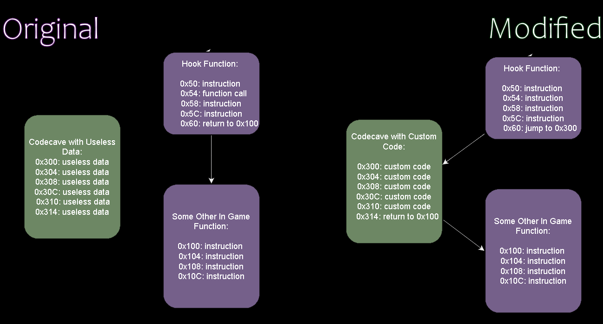

# C/C++ Game Modding Utility

**This utility aims to make writing mods/hacks for games in C/C++ easier.**  
It streamlines the process of compiling C/C++ with the intention of being injecting into a game, and interacting with its symbols.

#### This utility currently supports:
- Playstation 1 Games
- Playstation 2 Games
- Gamecube Games
- Wii Games*
- N64 Games* *(needs further testing)*

[Click here to see the Wiki](https://github.com/C0mposer/C-Game-Modding-Utility/wiki)

## Quick Start:
***This  quick start will get you up and running creating a mod that runs every frame along side a game***

#### Creating a Project
To get started, you'll need to create a project for your game mod.
Once you have created a project choose your games platform, and ***ISO File***. The tool will ask you to extract the ISO to a folder of your choosing, and will attempt to automatically find the games ***main executable file***.
##### Main Executable File
* For PS1/PS2 games, the executable should start with **SCUS**, **SCES**, 
**SLUS**, **SLES**, etc
* For Gamecube/Wii games, the executable should be named **Start.dol or main.dol**

Next, you'll need to find a ***code cave(s)*** to place your mod code, and a ***hook*** to jump to it.
#### Code Caves and Hooks
At a high level, here is how injecting mod code into a game using this utility works:
1.  **Code caves:** First things first, we need a free place in the games ram that can be used for the mod code. The easiest way is to look for unused/free sections of the games main executable, that also still happens to get loaded into ram. These free sections are called [code caves.](https://en.wikipedia.org/wiki/Code_cave)  (*These can unused/debug strings, unused functions/code, sometimes a block of 0's, etc*. If you need help finding a code cave, [see here](https://github.com/C0mposer/C-Game-Modding-Utility/wiki/Finding-a-Code-Cave))
Once you have found a code cave you fill out its info, and click "**Add/Save Codecave**": 

a. Give the code cave a name  
b. Fill out the address in RAM  
c. Fill out the equivalent address in main executable (or enter offset)  
d. Fill out the size of the code cave
e. Choose .c/.cpp files in your projects *src/* dir you'd like to be compiled into the codecave area  
(*main.c is used by default. For multiple files, seperate by comma or space*)  
  
2. **Hooks:** Once you have found a code cave to place your custom mod code into, you'll need a way to get the game to actually run it! This is where a [hook](https://en.wikipedia.org/wiki/Hooking#:~:text=Function%20hooking%20is%20implemented%20by,injected%20code) comes in. A hook is a function in the original game, from which we redirect to our custom code. The most simple and useful type of hook for a mod is a function in the original game that gets ran every frame. Our custom code runs whenever the hooked function runs. So if our hook runs every frame, so will our custom code!  
(This utility attempts to automatically find every-frame hooks for most platforms. It however isn't perfect, so if you need help manually finding a hook, [see here](https://github.com/C0mposer/C-Game-Modding-Utility/wiki/Finding-A-Hook#finding-an-every-frame-hook))

Here is a very basic visualization of the concept:

As seen here, we are simply redirecting the games instruction flow to jump to our custom code in the code cave, and then jumping right back to where it planned to go initially.

By default, the automatic hook uses ***asm/main_hook.s*** as the asm file that jumps/branches to the codecave. By default, main_hook.s jumps/branches to **CustomFunction** in the main.c file
```asm
j CustomFunction
```

If you want to change which function gets jumped to by the hook, you can change the **.s** file to jump/branch to any function name in your project. (*Keep this in mind if you rename CustomFunction*)

#### Writing Mods
Once you have found a codecave to place your mod code, and a hook to jump to it, you are ready to start writing mods for your game! 
It will have created a folder for your game mod in the **projects/** folder of the utility that you can start editing code in. 
*(You can automatically integrate your project with VSCode, Sublime, or Notepad++ with the Text Editor tab in the utility.)*

When writing mods for a game, ultimately all we are doing is **changing values in memory**, or **changing the flow of instructions**. So how do we talk with in game memory addresses in our code directly?
##### Symbols
- **Symbols:** Symbols are in game variables that you want to use, and in game functions you want to call. You can use memory seraching tools similar to Cheat Engine, in combination with debugging emulators and decompilation tools like Ghidra in order to find in game symbols.

Once you have found symbols you want to use in your mod, you can simply use the **in_game** keyword in order to declare them in your C/C++ code for use like so:

```c
//In Game Variables
in_game short coins; 	 	//0x8080DD84
in_game short lives; 	 	//0x8080DD86
in_game int jump_height;	//0x8080DD00
in_game int player_position[3]; //0x8080DC00

//In Game Functions
in_game int ReturnCompletionPercentage(void); 	 	//0x800501C0
in_game void DrawText(char* text_string, int x, int y); //0x80048250

```
*Note that you MUST put the memory address of the symbol as a // comment next to the declaration. in_game is not a real keyword, just a shortcut i've added to avoid adding symbols manually*

Once you declare the symbols as **in_game** variables/functions with their memory address in a **//** comment, you can use them in your code like any other variable/function:
```c
//Mod Code
void MainHook(void) 
{
    int percentage = ReturnCompletionPercentage();
    if (percentage >= 50)
    {
        lives = 99;
        jump_height *= 2;
        DrawText("Mod Activated!", 10, 30);
    }
    return;
}
```

#### Compiling, Building, & Injecting
Once you have written some code, you can compile it with the "**Compile Mod**" button in the utility, or with one of the built in tasks in VSCode/Sublime.

If the compilation is successful, you can then build your mod to an ISO/BIN. You first select the original game ISO/BIN file as a base, then it will create a new ISO/BIN with your mod injected.

You can also inject your mod into supported emulators to test your mod without rebuilding an entire image. 

## Recommended Tools
 - [Ghidra](https://github.com/NationalSecurityAgency/ghidra/releases) is a swiss army knife for reverse engineering. In combination with the plugins below, it can make decompiling games a much nicer experience:
 ~ [PS1 Ghidra Plugin](https://github.com/lab313ru/ghidra_psx_ldr)
 ~ [PS2 Ghidra Plugin](https://github.com/chaoticgd/ghidra-emotionengine-reloaded)
 ~ [Gamecube/Wii Ghidra Plugin](https://github.com/Cuyler36/Ghidra-GameCube-Loader)
 - [Bizhawk](https://tasvideos.org/BizHawk/ReleaseHistory#Bizhawk261) for memory searching in PS1 games
 - [Cheat Engine](https://github.com/cheat-engine/cheat-engine) for memory searching in PS2 games, and other programs
 - [Dolphin Memory Engine](https://github.com/aldelaro5/Dolphin-memory-engine) for memory searching in Gamecube/Wii games
- [VSCode](https://github.com/microsoft/vscode) or [Sublime](https://www.sublimetext.com/) text editors, for automatic integration with projects
## Supported Emulators
#### Gamecube Emulators
 - [Dolphin 5.0-19870](https://dolphin-emu.org/download/dev/032c77b462a220016f23c5079e71bb23e0ad2adf/)   
 - [Dolphin 5.0-20240](https://dolphin-emu.org/download/dev/60e3b4c0932ca963c67922cd7deb5d7e90732b92/)  
 #### PS2 Emulators
 - [PCSX2 Stable 1.6.0](https://pcsx2.net/)  
 - [PCSX2 Nightly 1.7.5112](https://pcsx2.net/downloads/#:~:text=Links,Download)  
 #### PS1 Emulators
 - [Duckstation 0.1 5936](https://github.com/stenzek/duckstation/releases/tag/latest)  
 - [Mednefan 1.31](https://mednafen.github.io/releases/)  
 - [Mednefan 1.29](https://mednafen.github.io/releases/)  
 - [Bizhawk 2.6.1](https://tasvideos.org/BizHawk/ReleaseHistory#Bizhawk261)  

## Bundled Tools / Special Thanks
 - [devkitPro](https://github.com/devkitPro) for GCC toolchains targeted towards Gamecube/Wii PPC, as well as utilities for analyzing .dol files
 - [GCR](https://github.com/bsv798/gcrebuilder) for extracting/rebuilding Gamecube games. Copyright (c) Sergey Bizin
 - [mkpsxiso](https://github.com/Lameguy64/mkpsxiso) for extracting/rebuilding PS1 games. Copyright (c) Lameguy64
  - [ImgBurn](https://www.imgburn.com/) for rebuilding PS2 games Copyright (c) LIGHTNING UK!
  - [7zip](https://github.com/mcmilk/7-Zip) for solving life's greatest mysteries Copyright (c) mcmilk

## Contact

If you need any help using this utility, feel free to reach out to me on discord: **Composer** :)
